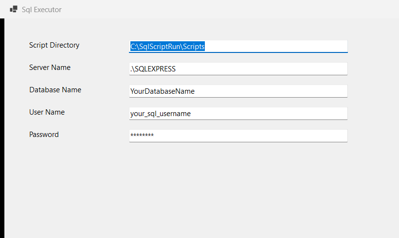

# SqlScriptExecutor


[](https://ci.appveyor.com/project/Mahadenamuththa/sqlscriptexecutor)


SqlScriptExecutor is a Windows desktop utility for loading SQL script execution settings from JSON configuration. The current application shows the configured script directory, SQL Server instance, database name, username, and a masked password in a WinForms interface. The service layer is separated from the UI so configuration loading and parsing can be tested independently.

## Screenshot



## Technologies

- .NET 8
- Windows Forms
- Microsoft.Extensions.Hosting
- Microsoft.Extensions.DependencyInjection
- System.Text.Json
- xUnit
- AppVeyor CI

## Architecture

The solution is split into four projects:

- `SSE.Forms`: WinForms desktop application and dependency injection bootstrap.
- `SSE.Services`: file, JSON, and executor services.
- `SSE.Models`: shared configuration model classes.
- `SSE.Tests`: xUnit tests for helpers and configuration loading behavior.

Runtime flow:

1. `SSE.Forms` starts a generic host.
2. Application services are registered through `AddApplicationServices`.
3. `ExecutorForm` resolves `IExecutorService`.
4. `ExecutorService` reads `AppConfig.json` from the app output directory, falling back to `AppConfig.example.json`.
5. The form displays configuration values and masks the password.

## Configuration

The application reads this JSON shape:

```json
{
  "SqlDirectory": "C:\\SqlScriptRun\\Scripts",
  "ServerName": ".\\SQLEXPRESS",
  "DatabaseName": "YourDatabaseName",
  "Username": "your_sql_username",
  "Password": "your_sql_password",
  "LogFile": "execution_log.txt",
  "ErrorDirectory": "C:\\SqlScriptRun\\error_directory",
  "SuccessDirectory": "C:\\SqlScriptRun\\success_directory"
}
```

Use `SSE.Forms/AppConfig.example.json` as the template for local configuration. Do not commit real database passwords or production server names.

## Build And Run

Prerequisites:

- Windows
- .NET 8 SDK

Build the solution:

```powershell
dotnet restore SqlScriptExecutor.sln
dotnet build SqlScriptExecutor.sln --configuration Release
```

Run the desktop app:

```powershell
dotnet run --project SSE.Forms\SSE.Forms.csproj
```

Run tests:

```powershell
dotnet test SqlScriptExecutor.sln --configuration Release
```

Check package vulnerabilities:

```powershell
dotnet list SqlScriptExecutor.sln package --vulnerable --include-transitive
```

## CI

`appveyor.yml` builds the solution on Visual Studio 2022, caches NuGet packages from `%USERPROFILE%\.nuget\packages`, runs the xUnit test suite, and runs the NuGet vulnerability audit.

## Security Notes

- The committed config values are placeholders only.
- Passwords are masked in the UI.
- Invalid or missing configuration now fails with explicit errors instead of silently loading an empty config.
- The package audit currently reports no vulnerable direct or transitive packages.
